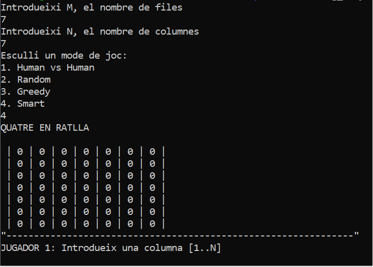
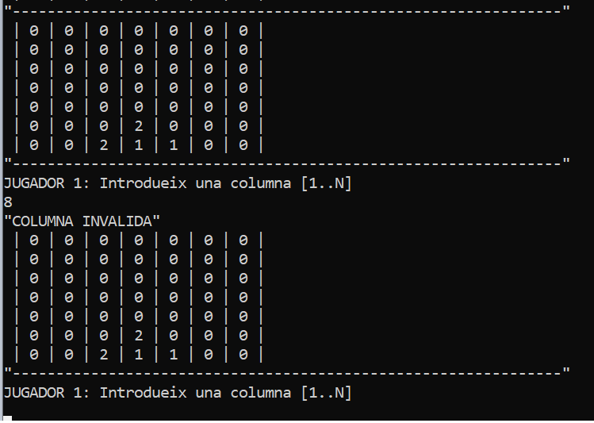

# 4 en Ratlla

Aquest petit projecte permet jugar el clàssic 4 en ratlla en 4 modalitats 
diferents.  
El joc del quatre en ratlla es juga en un tauler `n` × `m`, on `n` i `m` es
defineixen al començament de la partida. Els dos jugadors introdueixen de forma
alternada una de les seves fitxes en una columna. La fitxa cau fins dipositar-se
al d'amunt de l'última fitxa que s'ha introduït en la mateixa columna.
El guanyador (si hi ha), és el primer en aconseguir col·locar 4 en ratlla.

El programa permet escollir entre: 
- `Human vs Human`:
- Mode `random` contra la màquina: és fàcil guanyar
- Mode `greedy` contra la màquina: és relatívament fàcil guanyar
- Mode `smart` contra la màquina: guanyar hauria de ser difícil


## Getting Started

Aquestes instruccions et proporcionaran una còpia del projecte en funcionament a la teva màquina local amb finalitats de desenvolupament i proves.

### Prerequisits

Per executar el projecte necessites un compilador de Haskell. Pots descarregar la * [Haskell-Platform](https://www.haskell.org/platform/) 
O, si prefereixes, pots instal·lar-lo desde la línea de comandes. 

En Ubuntu, per exemple:

```bash
> sudo apt-get update && apt-get install ghc ghc-prof ghc-doc 
```

A més cal instal·lar el paquet `random`. Novament, en Ubuntu:

```bash
> sudo apt install cabal-install
> cabal update
> cabal install random
```
Amb això ja hauries de tenir a punt el compilador GHC, que et permetrà executar el projecte.

### Compilant

Per generar un executable del codi font `4ratlla.hs` només cal executar aquesta comanda

```bash
> ghc -o 4ratlla 4ratlla.hs
```

## Com es juga?

Un cop tenim el programa compilat, podem executar-lo sense haver de passar cap argument. El programa ens els anirà
demanant de forma dinàmica durant la seva execució
Veiem com és la inicialització d'una partida contra la màquina amb un taulell de 7x7 i en modalitat smart.



El programa sempre demana al jugador que faci la primera tirada. Cada vegada que s'introdueix una nova fitxa, el 
taulell s'actualitza i s'espera a l'entrada d'una nova fitxa.

La fitxa que s'introdueix ha d'entrar a una columna no-plena dins els límits del taulell. El sistema et demana un
valor (el de la columna) entre 1 i N. Si s'intenta introduir una fitxa a una posició 'invàlida', el programa t'informa
amb un error com aquest i et demana que tornis a tirar.




## Autor

* **Daniel Donate** 